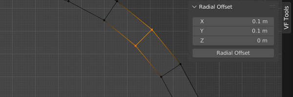
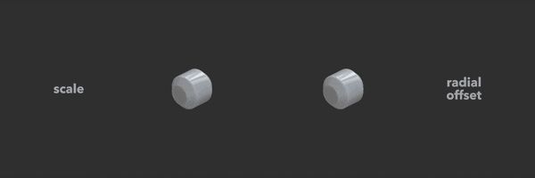
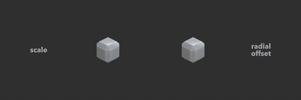
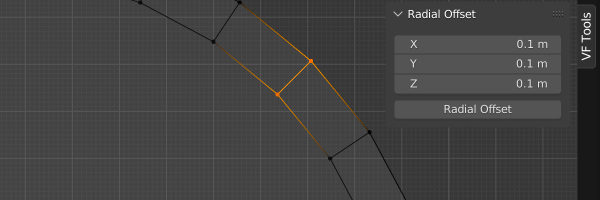
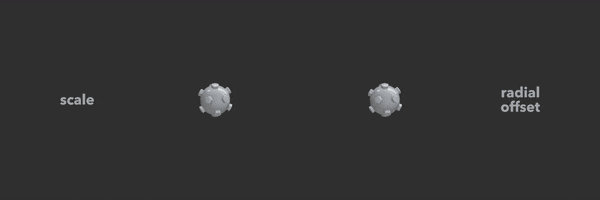

# VF Radial Offset

Offsets vertices radially to better preserve bevels and other spatial relationships, as opposed to scale.

One, two, and three dimensional modes support different needs.

## Installation and Usage
- Download [VF_radialOffset.py](https://raw.githubusercontent.com/jeinselenVF/VF-BlenderRadialOffset/main/VF_radialOffset.py)
- Open Blender Preferences and navigate to the "Add-ons" tab
- Install and enable the Add-on
- It will show up in the 3D view `VF Tools` tab

## Settings

- `XYZ Values`
	- Individual inputs per axis, allowing for 1D, 2D, and 3D functionality
		- See below for examples of how 1D, 2D, and 3D radial offset differs from simple scaling
	- Using dissimilar values can create ovoid results while still preserving the spatial relationships of vertices that are radially inline
		- This will not work with bevels in 3D mode, but offsetting in two dimensions will retain bevels that are aligned with the third axis
	- Positive and negative values will determine if vertices are offset away from or toward the centre of the model
- `Radial Offset`
	- Click this to calculate vectors and offset each vertex in the defined direction

## One Dimension

Setting only one axis to a non-zero value will offset vertices in that one direction, splitting them at the model's centre point without stretching the sides.

## Two Dimensions

Setting two axes to non-zero values will offset vertices in a circular pattern, best used for changing the size of watch faces, columns, and other cylindrical shapes without changing bevels aligned with the third axis.

## Three Dimensions

Setting all three axes to non-zero values will offset vertices in a spherical direction, best used for scaling spheres while preserving the local height of surface details.

## Known Limitations

- Does not work on objects with shape keys
- When multiple objects are selected, only the _active_ selected object is affected (does not support batch processing multiple models)